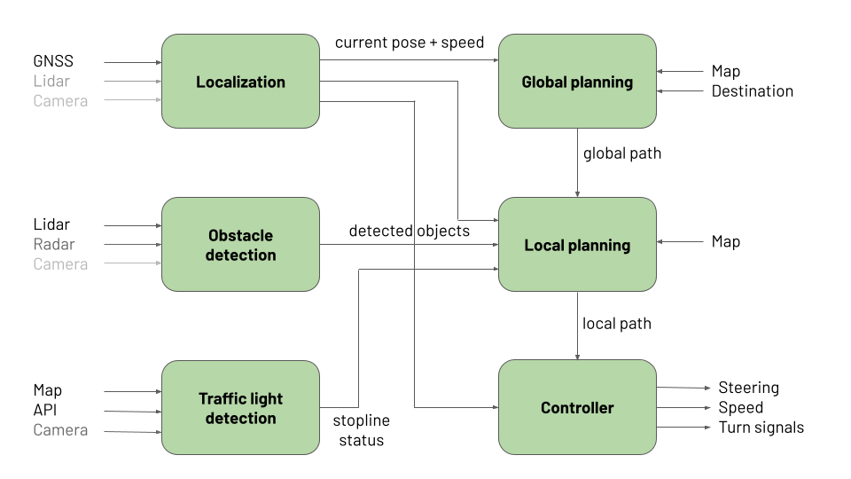

# Autoware Mini

Autoware Mini is a minimalistic Python-based autonomy software. It is built on Python and ROS 1 to make it easy to get started and tinkering. It uses Autoware messages to define the interfaces between the modules, aiming to be compatible with [Autoware](https://www.autoware.org/). Autoware Mini currently works on ROS Noetic (Ubuntu 20.04 and through [Conda RoboStack](https://robostack.github.io/) also on many other Linux versions). The software is open-source with a friendly MIT license.

## Goals

Our goals with the Autoware Mini were:
* easy to get started with --> minimal amount of dependencies
* simple and pedagogical --> simple Python nodes and ROS 1
* easy to implement machine learning based approaches --> Python

It is not production-level software, but aimed for teaching and research. At the same time we have validated the software with a real car in real traffic in the city center of Tartu, Estonia.

## Architecture



The key modules of Autoware Mini are:
* **Localization** - determines vehicle position and speed. Can be implemented using GNSS, lidar positioning, visual positioning, etc.
* **Global planner** - given current position and destination determines the global path to the destination. Makes use of Lanelet2 map.
* **Obstacle detection** - produces detected objects based on lidar, radar or camera readings. Includes tracking and prediction.
* **Traffic light detection** - produces status for stoplines, if they are green or red. Red stopline is like an obstacle for the local planner.
* **Local planner** - given the global path and obstacles, plans a local path that avoids obstacles and respects traffic lights.
* **Follower** - follows the local path given by the local planner, matching target speeds at different points of trajectory.

Here are couple of short videos introducing the Autoware Mini features.

[](https://www.youtube.com/watch?v=k3dOySPAYaY&list=PLuQzXioASss3dJvI9kLvriGXMfQEYKXZO&index=1 "Autoware Mini planning simulator")
[](https://www.youtube.com/watch?v=bn3G2WqHEYA&list=PLuQzXioASss3dJvI9kLvriGXMfQEYKXZO&index=2 "Autoware Mini perception testing with SFA detector")
[](https://www.youtube.com/watch?v=OqKMQ5hUgn0&list=PLuQzXioASss3dJvI9kLvriGXMfQEYKXZO&index=3 "Autoware Mini perception testing with cluster detector")
[](https://www.youtube.com/watch?v=p8A05yQ1pfw&list=PLuQzXioASss3dJvI9kLvriGXMfQEYKXZO&index=4 "Autoware Mini Carla testing with ground truth detector")
[](https://www.youtube.com/watch?v=QEoPoBogIBc&list=PLuQzXioASss3dJvI9kLvriGXMfQEYKXZO&index=5&t=2s "Autoware Mini Carla testing with cluster detector")

## Installation

You should have ROS Noetic installed, follow the official instructions for [Ubuntu 20.04](http://wiki.ros.org/noetic/Installation/Ubuntu) or [RoboStack](https://robostack.github.io/GettingStarted.html). Some of the nodes need NVIDIA GPU and CUDA, follow [the official instructions](https://docs.nvidia.com/cuda/cuda-installation-guide-linux/index.html). At this point we suggest CUDA 11.8. Notice that the default setup runs without GPU.

1. Create workspace
   ```
   mkdir -p autoware_mini_ws/src
   cd autoware_mini_ws/src
   ```

2. Clone the repos
   ```
   git clone https://github.com/UT-ADL/autoware_mini.git
   # not needed for planner simulation
   git clone https://github.com/UT-ADL/vehicle_platform.git
   # if using Carla simulation
   git clone --recurse-submodules https://github.com/carla-simulator/ros-bridge.git carla_ros_bridge
   ```

3. Install system dependencies

   ```
   rosdep update
   rosdep install --from-paths . --ignore-src -r -y
   ```

4. Install Python dependencies
   ```
   pip install -r autoware_mini/requirements.txt
   ```

5. Build the workspace
   ```
   cd ..
   catkin build
   ```

6. Source the workspace environment
   ```
   source devel/setup.bash
   ```
   As this needs to be run every time before launching the software, you might want to add something similar to the following line to your `~/.bashrc`.
   ```
   source ~/autoware_mini_ws/devel/setup.bash
   ```

## Launching planner simulation

Planner simulation is very lightweight and has the least dependencies. It should be possible to run it on any modern laptop without GPU.

```
roslaunch autoware_mini start_sim.launch
```

You should see RViz window with the default map. To start driving you need to give the vehicle initial position with **2D Pose Estimate** button and destination using **2D Nav Goal** button. Static obstacles can be placed or removed with **Publish Point** button. Initial position can be changed during movement.

To test planner simulation with real-time traffic light status from Tartu:

```
roslaunch autoware_mini start_sim.launch tfl_detector:=mqtt
```

## Launching against recorded bag

Running the autonomy stack against recorded sensor readings is a convenient way to test the detection nodes. An example bag file can be downloaded from [here](https://drive.google.com/file/d/1zr9z21a3jZyzWFshZ7WI6zDHx157UJIp/view?usp=share_link) and it should be saved to the `data/bags` directory.

```
roslaunch autoware_mini start_bag.launch
```

The example bag file is launched by default. To launch the stack against any other bag file include `bag_file:=<name of the bag file in data/bags directory>` in the command line.

The detection topics in bag are remapped to dummy topic names and new detections are generated by the autonomy stack. By default the `lidar_cluster` detection algorithm is used, which runs on CPU. To use GPU-based SFA detector include in the command line `detector:=lidar_sfa`. 

```
roslaunch autoware_mini start_bag.launch detector:=lidar_sfa
```

Other possible `detector` argument values worth trying are `radar`, `lidar_cluster_radar_fusion` and `lidar_sfa_radar_fusion`. Notice that blue dots represent lidar detections, red dots represent radar detections and green dots represent fused detections.

Another possible test is to run camera-based traffic light detection against bag:

```
roslaunch autoware_mini start_bag.launch tfl_detector:=camera
```

To see the traffic light detections enable **Detections** > **Traffic lights** > **Left ROI image** and **Right ROI image** in RViz. 

## Launching Carla simulation

### Installation (skip if already done)

1. Download [Carla 0.9.13](https://carla-releases.s3.eu-west-3.amazonaws.com/Linux/CARLA_0.9.13.tar.gz).
2. Extract the file with `tar xzvf CARLA_0.9.13.tar.gz`. We will call this extracted folder `<CARLA ROOT>`.
3. Download [Tartu.tar.gz](https://drive.google.com/file/d/10CHEOjHyiLJgD13g6WwDZ2_AWoLasG2F/view?usp=share_link).
4. Copy `Tartu.tar.gz` inside the `Import` folder under `<CARLA ROOT>` directory.
5. Run `./ImportAssets.sh` from the `<CARLA ROOT>` directory. This will install the Tartu map. (You can now delete the `Tartu.tar.gz` file from the `Import` folder.)
6. Since we will be referring to `<CARLA ROOT>` a lot, let's export it as an environment variable. Make sure to replace the path where Carla is extracted.

   ```
   export CARLA_ROOT=$HOME/path/to/carla
   ```

7. Now, enter the following command. (**NOTE:** Here we assume that `CARLA_ROOT`  was set from the previous command.)
   ```
   export PYTHONPATH=$PYTHONPATH:${CARLA_ROOT}/PythonAPI/carla/dist/carla-0.9.13-py3.7-linux-x86_64.egg:${CARLA_ROOT}/PythonAPI/carla/agents:${CARLA_ROOT}/PythonAPI/carla
   ```
   **Note:** It will be convenient if the above variables are automatically exported whenever you open a terminal. Putting above exports in `~/.bashrc` will reduce the hassle of exporting everytime.

### Launch instructions

1. In a new terminal, (assuming enviornment variables are exported) run Carla simulator by entering the following command.

   ```
   $CARLA_ROOT/CarlaUE4.sh -prefernvidia -quality-level=Low
   ```

2. In a new terminal, (assuming enviornment variables are exported) run the following command. This runs Tartu environment of Carla with minimal sensors and our autonomy stack. The detected objects and traffic light statuses come from Carla directly.

   ```
   roslaunch autoware_mini start_carla.launch
   ```

   In RViz enable **Simulation** > **Carla camera view** or **Carla image view** to see the third person view behind the vehicle. Set destination as usual with **2D Nav Goal** button. 

   You can also run full Carla sensor simulation and use actual detection nodes. For example to launch Carla with cluster-based detector:

   ```
   roslaunch autoware_mini start_carla.launch detector:=lidar_cluster
   ```

   Or to launch Carla with camera-based traffic light detection.

   ```
   roslaunch autoware_mini start_carla.launch tfl_detector:=camera
   ```

### Launching with Scenario Runner

1. Clone [Scenario Runner](https://github.com/carla-simulator/scenario_runner) to a directory of your choice
   ```
   git clone git@github.com:carla-simulator/scenario_runner.git
   ```
2. Install requirements
   ```
   pip install -r scenario_runner/requirements.txt
   ```
3. Point environment variable SCENARIO_RUNNER_ROOT to the Scenario Runner location
   ```
   export SCENARIO_RUNNER_ROOT=<path_to>/scenario_runner
   ```
4. Launch Autoware Mini with `use_scenario_runner=true` parameter
   ```
   roslaunch autoware_mini start_carla.launch use_scenario_runner=true
   ```
   At the moment you need to manually set the destination for the ego car.

## Launching in Lexus

### Ouster driver installation (one time only)

1. Ensure all dependencies are installed:

   ```
   sudo apt install -y build-essential libeigen3-dev libjsoncpp-dev libspdlog-dev libcurl4-openssl-dev
   ```

2. Go to the autoware_mini src directory:
   
   ```
   cd ~/autoware_mini_ws/src
   ```
3. Clone the latest Ouster driver repository:  

   ```
   git clone --recurse-submodules https://github.com/ouster-lidar/ouster-ros.git
   ```
4. Move to the Autoware mini catkin workspace:

   ```
   cd ~/autoware_mini_ws
   ```
5. Build the Ouster driver:
   
   ```
   catkin build --cmake-args -DCMAKE_BUILD_TYPE=Release 
   ```
### Launching Autoware mini

   ```
   roslaunch autoware_mini start_lexus.launch
   ```
