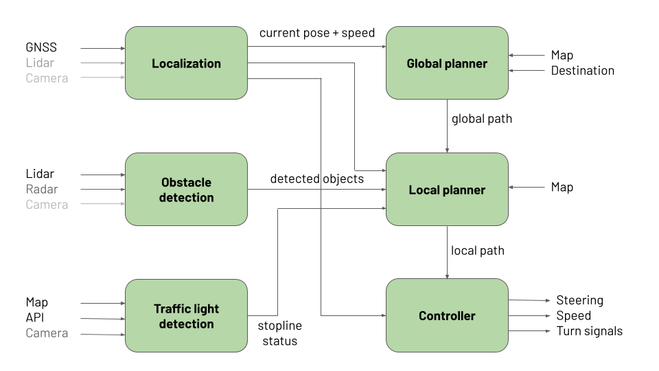

# Autoware Mini

Autoware Mini is a minimalistic Python-based autonomy software inspired by [Autoware](https://www.autoware.org/). It is built on Python and ROS 1 to make it easy to get started. Autoware Mini currently works on ROS Noetic (Ubuntu 20.04). It is possible to get it also working on later Ubuntus using [ROS One](https://github.com/ros-o/ros-o). The software is open-source with a friendly MIT license.

## Goals

Our goals with the Autoware Mini were:
* easy to get started with --> minimal amount of dependencies
* simple and pedagogical --> simple Python nodes and ROS 1
* easy to implement machine learning based approaches --> Python

It is not production-level software, but aimed for teaching and research. At the same time we have validated it with a real car in real traffic in the city of Tartu, Estonia.

## Architecture



The key modules of Autoware Mini are:
* **[Localization](nodes/localization)** - determines vehicle position and speed. Can be implemented using GNSS, lidar SLAM, visual SLAM, etc.
* **[Object detection](nodes/perception)** - produces detected objects based on lidar, radar or camera sensors. Includes tracking and prediction.
* **[Traffic light detection](nodes/perception/traffic_lights)** - produces status for stop lines, if they are green or red. Red stop line is like an obstacle for the local planner.
* **[Global planner](nodes/planning/global)** - given current position and destination determines the global path to the destination. Makes use of Lanelet2 map.
* **[Local planner](nodes/planning/local)** - given the global path and objects, plans a local path that avoids obstacles and respects traffic lights.
* **[Controller](nodes/control)** - follows the local path given by the local planner, matching target speeds at different points of trajectory.

Here are couple of (slightly outdated) short videos introducing the Autoware Mini features.

[](https://www.youtube.com/watch?v=k3dOySPAYaY&list=PLuQzXioASss3dJvI9kLvriGXMfQEYKXZO&index=1 "Autoware Mini planning simulator")
[](https://www.youtube.com/watch?v=bn3G2WqHEYA&list=PLuQzXioASss3dJvI9kLvriGXMfQEYKXZO&index=2 "Autoware Mini perception testing with SFA detector")
[](https://www.youtube.com/watch?v=OqKMQ5hUgn0&list=PLuQzXioASss3dJvI9kLvriGXMfQEYKXZO&index=3 "Autoware Mini perception testing with cluster detector")
[](https://www.youtube.com/watch?v=p8A05yQ1pfw&list=PLuQzXioASss3dJvI9kLvriGXMfQEYKXZO&index=4 "Autoware Mini Carla testing with ground truth detector")
[](https://www.youtube.com/watch?v=QEoPoBogIBc&list=PLuQzXioASss3dJvI9kLvriGXMfQEYKXZO&index=5&t=2s "Autoware Mini Carla testing with cluster detector")

## Prerequisites

> **On Ubuntu 22.04 or 24.04?** These instructions target Ubuntu 20.04 (ROS Noetic, CUDA 11). For newer Ubuntu (ROS One + CUDA 12), follow [INSTALL_ubuntu2224.md](INSTALL_ubuntu2224.md) instead.

1. You should have ROS Noetic installed, follow the official instructions for [Ubuntu 20.04](http://wiki.ros.org/noetic/Installation/Ubuntu).

2. Some of the nodes need NVIDIA GPU, CUDA, cuDNN and TensorRT. At this point we suggest installing CUDA 11.8 for the best compatibility. **Notice that the default setup also runs without GPU.**

   ```
   wget https://developer.download.nvidia.com/compute/cuda/repos/ubuntu2004/x86_64/cuda-keyring_1.1-1_all.deb
   sudo dpkg -i cuda-keyring_1.1-1_all.deb
   sudo apt-get update
   sudo apt-get install cuda-toolkit-11-8 libcudnn8=8.9.7.29-1+cuda11.8 libnvinfer10=10.0.1.6-1+cuda11.8 libnvinfer-plugin10=10.0.1.6-1+cuda11.8 libnvonnxparsers10=10.0.1.6-1+cuda11.8
   ```
   This installs the CUDA toolkit only and does not touch your NVIDIA driver. Ensure you have a driver supporting CUDA 11.8 (>= 520); install one with `sudo ubuntu-drivers autoinstall` if needed.

   In case the above instructions are out of date, follow the official [CUDA](https://docs.nvidia.com/cuda/cuda-installation-guide-linux/index.html) and [cuDNN](https://docs.nvidia.com/deeplearning/cudnn/installation/latest/linux.html) installation instructions.

## Installation

1. Create workspace
   ```
   mkdir -p ~/autoware_mini_ws/src
   cd ~/autoware_mini_ws/src
   ```

2. Clone the repo
   ```
   git clone https://github.com/UT-ADL/autoware_mini.git
   ```

3. Install system dependencies (ignore the errors for missing Carla packages, we will install them later)

   ```
   rosdep update --include-eol-distros
   rosdep install --include-eol-distros --from-paths . --ignore-src -r -y
   ```

4. Install Python dependencies
   ```
   pip install -r autoware_mini/requirements_ubuntu20.txt
   # only when planning to use GPU-based clustering, long download
   pip install -r autoware_mini/requirements_cuda11.txt
   ```

5. Build the workspace
   ```
   cd ..
   catkin build
   ```

6. Source the workspace environment
   ```
   source devel/setup.bash
   ```
   As this needs to be run every time before launching the software, you might want to add it to your `~/.bashrc`.
   ```
   echo "source ~/autoware_mini_ws/devel/setup.bash" >> ~/.bashrc
   ```

## Launching planner simulation

Planner simulation is very lightweight and has the least dependencies. It should be possible to run it on any modern laptop without GPU.

```
roslaunch autoware_mini start_sim.launch
```

You should see RViz window with the default map. To start driving you need to give the vehicle initial position with **2D Pose Estimate** button and destination using **2D Nav Goal** button. Static obstacles can be placed or removed with **Publish Point** button. Initial position can be changed during movement.

To test planner simulation with real-time traffic light status from Tartu:

```
roslaunch autoware_mini start_sim.launch tfl_detector:=mqtt
```

## Launching against recorded bag

Running the autonomy stack against recorded sensor readings is a convenient way to test the detection nodes. An example bag file can be downloaded from [here](https://drive.google.com/file/d/1rFDmUaqjApCEv8PqPAS5zCYA8VJt6xA_/view?usp=sharing) and it should be saved to the `data/bags` directory.

Following launches the example bag by default:

```
roslaunch autoware_mini start_bag.launch
```

To launch the stack against any other bag file include `bag_file:=<name of the bag file in data/bags directory>` in the command line.

The detection topics in bag are remapped to dummy topic names and new detections are generated by the autonomy stack. By default the `lidar_cluster` detection algorithm is used, which works both on CPU and GPU. To use GPU-only neural network based SFA detector include in the command line `detector:=lidar_sfa`. 

```
roslaunch autoware_mini start_bag.launch detector:=lidar_sfa
```

Other possible `detector` argument values worth trying are `radar`, `lidar_cluster_radar_fusion` and `lidar_sfa_radar_fusion`. Notice that blue dots represent lidar detections, red dots represent radar detections and green dots represent fused detections.

Another possible test is to run camera-based traffic light detection against bag:

```
roslaunch autoware_mini start_bag.launch tfl_detector:=camera
```

To see the camera traffic light detections enable **Detections** > **Traffic lights** > **Left ROI image** and **Right ROI image** in RViz. Other possible `tfl_detector` argument values are `yolo`, `camera_mqtt_fusion` and `yolo_mqtt_fusion`. Note that there is no point to use `mqtt` with bag files, as real-time traffic light status is not appropriate for recorded data.

## Launching Carla simulation

### Installation (one time only)

> If you use Ubuntu 24 or newer, install CARLA **0.9.16** + python client, instead of 0.9.15 below (0.9.15 has no Python 3.12 client). The 0.9.15 Tartu/Lexus assets are compatible with 0.9.16.

1. Create a directory into which to install carla and export it as `CARLA_ROOT`. Also update `PYTHONPATH` to make Carla agents importable in Python.
   ```
   mkdir ~/CARLA_0.9.15
   export CARLA_ROOT=$HOME/CARLA_0.9.15
   export PYTHONPATH=$PYTHONPATH:${CARLA_ROOT}/PythonAPI/carla
   ```
   **Note:** Putting the above exports in `~/.bashrc` will reduce the hassle of exporting them every time you open a terminal.
   ```
   echo "export CARLA_ROOT=$HOME/CARLA_0.9.15" >> ~/.bashrc
   echo "export PYTHONPATH=$PYTHONPATH:${CARLA_ROOT}/PythonAPI/carla" >> ~/.bashrc
   ```
2. Change into the directory and download [Carla 0.9.15](https://tiny.carla.org/carla-0-9-15-linux).
   ```
   cd $CARLA_ROOT
   wget https://tiny.carla.org/carla-0-9-15-linux -O CARLA_0.9.15.tar.gz
   ```
3. Extract the file
   ```
   tar xzvf CARLA_0.9.15.tar.gz
   ```
4. Delete the downloaded carla archive file.
   ```
   rm CARLA_0.9.15.tar.gz
   ```
5. Go to the `Import` directory
   ```
   cd Import
   ```
6. Download [tartu_demo.tar.gz](https://github.com/UT-ADL/carla_tartu_demo/releases/download/v0.9.15.2/tartu_demo_v0.9.15.2.tar.gz).
   ```
   wget https://github.com/UT-ADL/carla_tartu_demo/releases/download/v0.9.15.2/tartu_demo_v0.9.15.2.tar.gz
   ```
7. Download [utlexus.tar.gz](https://github.com/UT-ADL/carla_lexus/releases/download/v0.9.15/utlexus.tar.gz).
   ```
   wget https://github.com/UT-ADL/carla_lexus/releases/download/v0.9.15/utlexus.tar.gz
   ```
8. Move to the parent directory
   ```
   cd ..
   ```
9. Import the `tartu_demo` map and the UT Lexus vehicle model.
   ```
   ./ImportAssets.sh
   ```
   > For Ubuntu 24+ and CARLA 0.9.16: `ImportAssets.sh` uses `tar --keep-newer-files` and skips the older Lexus `VehicleFactory.uasset`. Force overwrite with: `tar xf Import/utlexus.tar.gz --overwrite`.
10. Delete the `tartu_demo_v0.9.15.2.tar.gz` and `carla_lexus-0.9.15.tar.gz` files from the `Import` directory
    ```
    rm Import/tartu_demo_v0.9.15.2.tar.gz Import/carla_lexus-0.9.15.tar.gz
    ```
11. Now, install the Carla Python module
    ```
    pip install carla==0.9.15
    ```
12. Install CARLA dependencies:
    ```
    sudo apt install libomp5
    ```
13. Clone the CARLA ROS bridge repo:
    ```
    cd ~/autoware_mini_ws/src
    git clone --recurse-submodules https://github.com/UT-ADL/ros-bridge carla_ros_bridge
    ```
    > For Ubuntu 24+ and CARLA 0.9.16: edit `carla_ros_bridge/carla_ros_bridge/src/carla_ros_bridge/CARLA_VERSION` from `0.9.15` to `0.9.16`, or the bridge aborts with a version-mismatch check.
14. Install CARLA ROS bridge dependencies:
    ```
    carla_ros_bridge/install_dependencies.sh
    ```
17. Build the workspace
    ```
    cd ..
    catkin build
    ```

### Launch instructions

1. In a terminal window (assuming enviornment variables are exported) run Carla simulator

   ```
   cd $CARLA_ROOT
   ./CarlaUE4.sh
   ```

   To force using NVIDIA GPU for rendering add `-prefernvidia` to command line. To hide the default CARLA window add `-RenderOffScreen`. To improve the frame rate you can try `-quality-level=Low`.

2. In another terminal window (assuming enviornment variables are exported) run the following command. This runs Tartu environment of Carla with minimal sensors and our autonomy stack. The detected objects and traffic light statuses come directly from Carla ground truth.

   ```
   roslaunch autoware_mini start_carla.launch
   ```

   In RViz enable **Simulation** > **Carla image view** or **Carla camera view** to see the third person view behind the vehicle. Set destination as usual with **2D Nav Goal** button. 

   You can also run full Carla sensor simulation and use actual detection nodes. For example to launch Carla with cluster-based detector:

   ```
   roslaunch autoware_mini start_carla.launch detector:=lidar_cluster
   ```

   Or to launch Carla with camera-based traffic light detection.

   ```
   roslaunch autoware_mini start_carla.launch tfl_detector:=camera
   ```

   **NB!** Enabling both can make the simulation unbearably slow.

### Launching with Scenario Runner

1. Clone [Scenario Runner](https://scenario-runner.readthedocs.io/en/latest/) to a directory of your choice
   ```
   git clone https://github.com/UT-ADL/scenario_runner.git
   ```
2. Install requirements
   ```
   pip install -r scenario_runner/requirements.txt
   ```
3. We need to make sure that different modules find each other. Following environment variables should be set in `.bashrc`.
   ```
   echo "export SCENARIO_RUNNER_ROOT=<path_to>/scenario_runner" >> ~/.bashrc
   ```
4. In a terminal window (assuming enviornment variables are exported) run Carla simulator:

   ```
   cd $CARLA_ROOT
   ./CarlaUE4.sh
   ```
5. Launch the autonomy stack:

   a) **OpenScenario:** In another terminal window (assuming enviornment variables are exported) launch route scenario with:
   ```
   roslaunch autoware_mini start_carla.launch use_scenario_runner:=true
   ```
   You can now execute scenarios by choosing them from RViz Carla plugin dropdown and pressing Execute button. You need to manually set the destination for the ego car when scenario is launched. The predefined scenarios are available as `data/scenarios/MAP_NAME/SCENARIO_NAME.xosc`.

   **OR**

   b) **Route Scenario:**  In another terminal window (assuming enviornment variables are exported) launch route scenario with:
   ```
   roslaunch autoware_mini start_carla.launch use_scenario_runner:=true route_id:=0
   ```
   This will launch route scenarios using `route_id = 0` in the default `tartu_demo` routes definition file [tartu_demo.xml](data/routes/tartu_demo.xml).

## Launching in Lexus

### Installation (one time only)

1. Go to the autoware_mini src directory:
   
   ```
   cd ~/autoware_mini_ws/src
   ```
2. Clone the repo containing car driver dependencies and launch files:
   ```
   git clone https://github.com/UT-ADL/lexus_platform.git
   ```
3. Clone the latest Ouster driver repository:  

   ```
   git clone --recurse-submodules https://github.com/ouster-lidar/ouster-ros.git
   ```
4. Install system dependencies:
   ```
   rosdep install --include-eol-distros --from-paths . --ignore-src -r -y
   ```
5. Build the workspace:
   
   ```
   catkin build --cmake-args -DCMAKE_BUILD_TYPE=Release 
   ```
### Launching Autoware mini

   ```
   roslaunch autoware_mini start_lexus.launch
   ```

## Acknowledgements

We are standing on the shoulders of giants. These are the key libraries we are using:
 * [Autoware](https://autoware.org/) and especially [Autoware.AI](https://github.com/autowarefoundation/autoware_ai) - original inspiration and message format.
 * [Lanelet2](https://github.com/fzi-forschungszentrum-informatik/Lanelet2) - map format and global planning.
 * [Shapely](https://github.com/shapely/shapely) - collision detection and general geometry calculations.
 * [Numpy](https://numpy.org/) - efficient vectorized computations.
