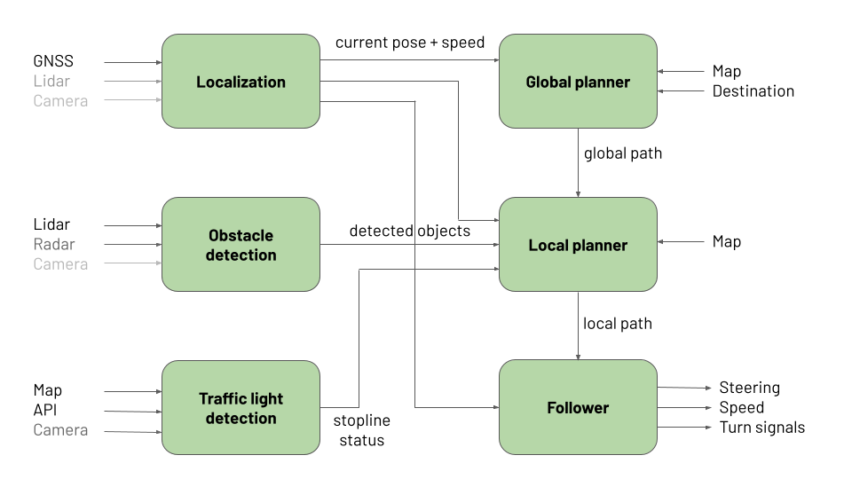

# Autoware Mini

Autoware Mini is minimalistic Python-based autonomy software. It is built on Python and ROS 1 to make it easy to get started and tinkering. It uses Autoware messages to define the interfaces between the modules, aiming to be compatible with Autoware nodes. Autoware Mini currently works on ROS Melodic (Ubuntu 18.04), but we aim to make it compatible also with ROS Noetic (Ubuntu 20.04 and Conda Robostack).

## Goal

We wanted an autonomy stack that
* would be easy to get started with --> minimal amount of dependencies
* would be simple and pedagogical --> simple Python nodes and ROS 1
* would be easy to implement machine learning based approaches --> Python

## Architecture



The key modules of Autoware Mini are:
* **Localization** - determines vehicle position and speed. Can be implemented using GNSS, lidar positioning, visual positioning, etc.
* **Global planning** - given current position and destination determines the global path to the destination. Makes use of HD map.
* **Obstacle detection** - produces detected objects based on lidar, radar or camera information. Includes tracking and prediction.
* **Local planning** - given global path and obstacles plans local path that avoids obstacles and respects traffic lights.
* **Traffic light detection** - produces status for stoplines, if they are green or red. Red stopline is like an obstacle for local planner.
* **Controller** - follows the local path given by the local planner, including target speeds at different points of trajectory.

## Installation

1. Create workspace
   ```
   mkdir -p autoware_mini_ws/src
   cd autoware_mini_ws/src
   ```

2. Clone the repo
   ```
   git clone git@gitlab.cs.ut.ee:autonomous-driving-lab/autoware.ai/local/vehicle_platform.git
   git clone git@gitlab.cs.ut.ee:autonomous-driving-lab/autoware_mini.git
   ```

3. Install system dependencies

   ```
   rosdep update
   rosdep install --from-paths . --ignore-src -r -y
   ```

4. Install Python dependencies
   ```
   pip install -r autoware_mini/requirements.txt
   ```

5. Build the workspace
   ```
   catkin build
   ```

## Launching simulation

```
roslaunch autoware_mini start_sim.launch
```

You should see Rviz window with a default map. You need to give the vehicle initial position with 2D Pose Estimate button and goal using 2D Nav Goal button.

## Launching with Carla

TBD


## Launching in Lexus

```
roslaunch autoware_mini start_lexus.launch
```