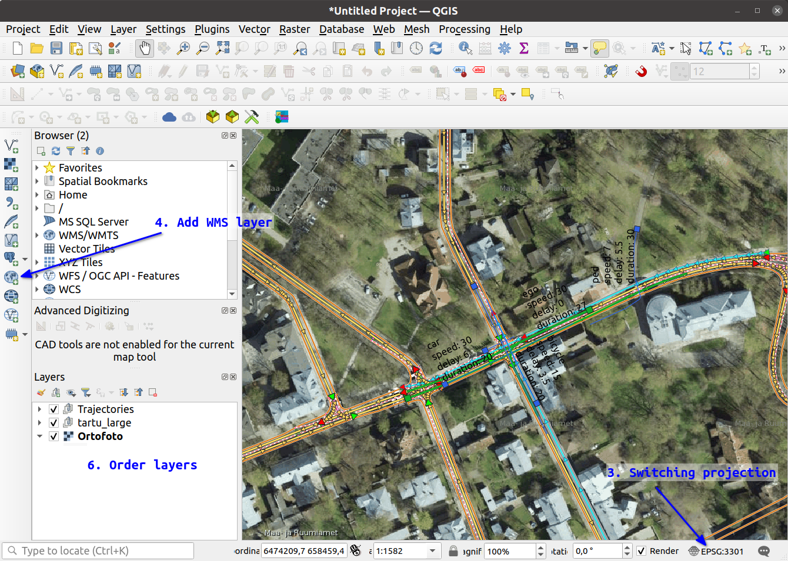
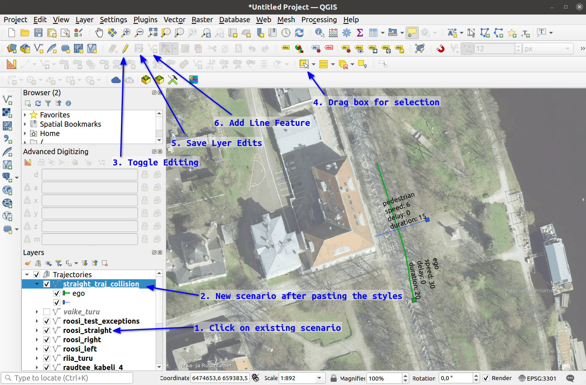

## Opening existing geojson scenarios

1. Open [QGIS](https://qgis.org/)
2. Drag and drop into QGIS view:
   - single geojson file (like `riia_turu.geojson`) - will load geojson without layer styling and symbology
   - QGIS layer definition file (`all_trajectory_files.qlr`) - will load one or more geojson files with symbology
3. You might want to switch the projection from EPSG:4326 WGS84 coordinate system (default in geojson files) to EPSG:3301 - Estonian national coordinate system
   - For switching click on the below right corner of the QGIS window - see below on the image
   - Switching coordinate system will remove distortions that are inevitable displaying WGS84 coordinates in 2D view (WGS84 global lat lon coordinates defining location on spherical Earth)
   - Estonian coordnate system is local and ment for 2D - cartesian coordinates
4. Add WMS layer from [Estonian Land Board](https://geoportaal.maaamet.ee/eng/services/public-wms-wfs-p346.html). See on the image below ehere t click and add `https://kaart.maaamet.ee/wms/fotokaart?` as source and diplay Orthopohoto layer.
5. You could also add `tartu_large` map from [autoware_maps repo](https://gitlab.cs.ut.ee/autonomous-driving-lab/autoware.ai/local/autoware_maps). Drag and drop the `tartu_large.qlr` into QGIS map or layer view. As minimum only 1 file is needed `tartu_large.gpkg` for data, but `tartu_large.qlr` adds layer styling - these files can be downloaded to your local folder, but should be kept together.
6. Further layer ordering and styling can be done in the Layers view, by dragging the layers or double clicking on the layer and selecting symbology.



## Geojson scenario file

* Geojson file is simple json file that contains geometry and attributes for features
* Each object and its trajectory will be represented as linestring having the parameters as described in the table below.
* Bag duration is determined by `ego` `duration` field. If other participant has smaller duration they will just dissapear when the duration is reached.
* Typically geojson scenario file contains WGS84 coordinates (EPSG:4326)

| Attributes | Mandatory | Unit | Explanation |
|----------|----------|----------|----------|
| `label`    | `ego` others optional | string | Have to have one `ego` label, optional for other participants |
| `speed`    | 0 if not specified | km/h | 0 will create static object |
| `duration`    | mandatory | seconds | defines the existance of the object always from the start of the bag    |
| `delay`    | 0 if not specified | seconds    | delays the creation of the object by this time    |
| `length` and `width` | optional | meters    | Default values are 4 x 2m added during the conversion script |


## Creating a geojson scenario

Geojson file should have linestring geometry type and contain the attributes in the previous tabel and have WGS84 coordinates. The file can be created from scratch, but easiest is to save an existing file to a new one, delete the existing features and add new ones.

1. Right click on top of existing geojson scenario, and select `Export` -> `Save Features As...`. In the pop up window select the directory where you want to save the file and add a file name. Check that Format is `GeoJSON` and CRS has `WGS84` all the other things should be already correct. Press OK.
2. New file should be added to your view (find the name in Layers), but without the symbology.
   * To be sure you can right-click on it and select `Zoom to Layer`
   * Right click on another geojson with trajectories that has symbology and select from there `Style` -> `Copy Style` -> `All Style Categories`
   * Right click on your newly create file and `Style` -> `Paste Style` -> `All Style Categories`
3. To delete previous geometries select it (in Layers view) and press `Toggle Editing` - pencil should appear on the layer.
4. Drag a box around all the features (should be highlighted in yellow) and press delete
5. You can press `Save Layer Edits`
6. Add new features by selecting `Add Line Feature`. Left clicks for adding points and right click for ending. Fill in the attributes after ending the drawing.
7. After all the participants are added click again `Save Layer Edits` and `Toggle Editing`



Scenario has been created!

## Adding traffic lights to scenarios

In `data/bag_scenarios/tartu_large/geojson/` there is also file `traffic_lights.geojson`. This file contains all the stop lines from the map that are regulated by traffic lights. It is created by running the script in the `/scripts/bag_scenarios/`. It should be rerun only if the map file in `/data/maps` has changed (for example updated) - then some stop lines might have different id's or mismatches between them.

```
./export_traffic_lights.py ../../data/maps/tartu_large.osm
```

1. Drag and drop this file to QGIS map window. It will be opened without any specific symbology, but it can be adjusted by doing left click and adding symbology from there.
2. To change the traffic light cycle there are 3 values to manipulate. First `Toggle Editing` should be selected and then clicking on the stop line with `Identify Feature` button and in the pop up window the feature attributes are displayed.
   - `id` - should not be changed
   - `offset` - traffic lights will always start from red cycle continued by green cyle and offset determines the starting offset. If red and green cycles last 10 seconds and offset is 8, the traffic light (actually stop line status) will be added to bag scenario with remaining 2 seconds for red and thein continues with 10 seconds for green followed by 10 seconds for red etc.
   - `red_duration` and `green_duration` - adjust the red green cycle durations
3. Once the traffic lights offsets and durations are editied, save the edits `Save Layer Edits` and switch off editing `Toggle Editing`
4. During converting the trajectories to scenarios the traffic light data will be added automaticallyfrom this file if `--add_traffic_lights` is added to conversion script command.


## Converting geojson to a scenario bag

There is a `trajectories_to_scenario.py` script for that in `/scripts/bag_scenarios/`. And it should be run as following:
* the argument `--add_traffic_lights` will also look if any trajectory intersects with the traffic light regulated stop line and add it to bag scenario

```
python trajectories_to_scenario.py ../../data/bag_scenarios/tartu_large/geojson/straight_traj_collision.geojson ../../data/bag_scenarios/tartu_large/planner_straight_traj_collision.bag --add_traffic_lights
```

To convert/regenerate all the scenarios again there is a script for that and it will automatically add also the `--add_traffic_lights` for each bag scenario. Important is that this script needs that geojson file is added to the csv file list in `/data/bag_scenarios/tartu_large/planner_geojson.csv`.

```
# script <path_to_geojson_list> <path_to_geojson_files>
./create_geojson_scenarios.sh /../../data/bag_scenarios/tartu_large/planner_geojson.csv /../../data/bag_scenarios/tartu_large/geojson
```


